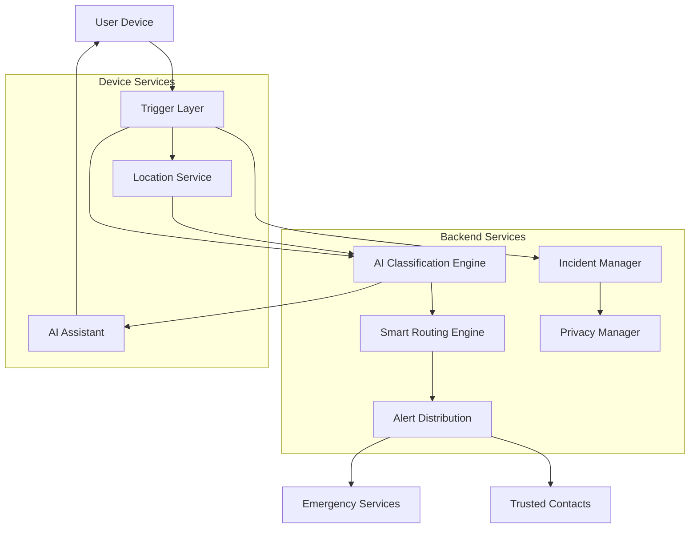

# Design Document: Sahaya Emergency Response System

## Overview

Sahaya is a comprehensive emergency response system that provides rapid, intelligent assistance during critical situations. The system architecture is designed around three core principles:

1. **Speed**: Sub-3-second response times for critical operations
2. **Reliability**: Offline-capable with automatic failover and 99.9% uptime
3. **Privacy**: Automatic data deletion after incident resolution

The system consists of several interconnected components:
- **Trigger Layer**: Handles multiple SOS activation methods (button, voice, auto-detection)
- **Location Services**: GPS and network-based positioning with continuous updates
- **AI Classification Engine**: Analyzes context to determine emergency type and priority
- **Routing Engine**: Identifies and ranks appropriate emergency services
- **Alert Distribution**: Sends notifications to responders and trusted contacts
- **AI Assistant**: Provides real-time guidance to users
- **Incident Management**: Tracks emergency lifecycle from trigger to closure
- **Privacy Manager**: Handles automatic data deletion

## Architecture

### High-Level Architecture



### Component Interaction Flow

1. **Emergency Trigger**: User activates SOS via button, voice, or auto-detection
2. **Signal Generation**: System creates Emergency_Signal with initial context
3. **Location Capture**: GPS coordinates captured and attached to signal
4. **AI Classification**: Emergency type and priority determined
5. **Service Routing**: Appropriate emergency services identified and ranked
6. **Alert Distribution**: Notifications sent to responders and contacts
7. **User Assistance**: AI provides real-time guidance
8. **Incident Tracking**: Status updates tracked throughout lifecycle
9. **Resolution & Cleanup**: Incident closed and data deleted

### Deployment Architecture

The system uses a hybrid architecture:
- **Mobile Client**: Native iOS/Android apps with offline capabilities
- **Edge Services**: Regional API gateways for low-latency responses
- **Core Services**: Centralized microservices for AI, routing, and incident management
- **Data Layer**: Distributed databases with automatic replication and encryption

## Components and Interfaces

### 1. Trigger Layer

**Responsibility**: Detect and process SOS activations from multiple sources

**Interfaces**:
```typescript
interface TriggerLayer {
  // Button trigger
  onButtonPress(): Promise<EmergencySignal>
  
  // Voice trigger
  onVoiceCommand(audioData: AudioBuffer): Promise<EmergencySignal>
  
  // Auto-detection trigger
  onSensorPattern(sensorData: SensorData): Promise<EmergencySignal>
  
  // Provide feedback to user
  provideFeedback(type: FeedbackType): void
}

interface EmergencySignal {
  id: string
  userId: string
  timestamp: Date
  triggerMethod: 'button' | 'voice' | 'auto'
  initialContext: Context
  location?: GPSLocation
  classification?: Classification
}

interface SensorData {
  accelerometer: Vector3D
  gyroscope: Vector3D
  timestamp: Date
}

type FeedbackType = 'visual' | 'haptic' | 'audio'
```

**Implementation Notes**:
- Button trigger uses native UI event handlers with debouncing
- Voice trigger uses on-device speech recognition for privacy and speed
- Auto-detection monitors accelerometer and gyroscope for fall detection patterns
- All triggers generate signals within required time constraints (2-3 seconds)

### 2. Location Service

**Responsibility**: Capture and continuously update user location

**Interfaces**:
```typescript
interface LocationService {
  // Capture current location
  captureLocation(): Promise<GPSLocation>
  
  // Start continuous location updates
  startTracking(intervalSeconds: number): void
  
  // Stop location updates
  stopTracking(): void
  
  // Get location with fallback to network positioning
  getLocationWithFallback(): Promise<GPSLocation>
}

interface GPSLocation {
  latitude: number
  longitude: number
  accuracy: number // meters
  altitude?: number
  timestamp: Date
  source: 'gps' | 'network' | 'cell'
}
```

**Implementation Notes**:
- Primary: GPS with high accuracy mode
- Fallback: Network-based positioning (WiFi/cell tower triangulation)
- Updates every 10 seconds during active incidents
- Includes accuracy metadata for responder confidence

### 3. AI Classification Engine

**Responsibility**: Analyze emergency context and assign type and priority

**Interfaces**:
```typescript
interface AIClassifier {
  // Classify emergency signal
  classify(signal: EmergencySignal): Promise<Classification>
  
  // Update classification based on new information
  reclassify(incidentId: string, newContext: Context): Promise<Classification>
}

interface Classification {
  emergencyType: EmergencyType
  priorityLevel: PriorityLevel
  confidence: number // 0-1
  reasoning: string[]
  timestamp: Date
}

type EmergencyType = 'Medical' | 'Accident' | 'Safety'
type PriorityLevel = 'High' | 'Medium' | 'Low'

interface Context {
  sensorData?: SensorData
  voiceTranscript?: string
  userInput?: string
  medicalHistory?: MedicalInfo
  timeOfDay: Date
  locationContext?: LocationContext
}

interface LocationContext {
  locationType: 'home' | 'work' | 'public' | 'vehicle' | 'unknown'
  nearbyFacilities: string[]
}
```

**Implementation Notes**:
- Uses machine learning model trained on emergency patterns
- Considers multiple factors: sensor data, voice input, time, location, medical history
- Confidence threshold of 70% - below this defaults to High priority
- Model runs on backend for consistency and updates
- Classification completes within 2 seconds

### 4. Smart Routing Engine

**Responsibility**: Identify and rank appropriate emergency services

**Interfaces**:
```typescript
interface RoutingEngine {
  // Find appropriate emergency services
  routeEmergency(
    classification: Classification,
    location: GPSLocation
  ): Promise<RoutingResult>
  
  // Get real-time service availability
  checkAvailability(serviceIds: string[]): Promise<AvailabilityStatus[]>
}

interface RoutingResult {
  primaryServices: EmergencyService[]
  backupServices: EmergencyService[]
  estimatedResponseTimes: Map<string, number> // serviceId -> minutes
  routingReasoning: string
}

interface EmergencyService {
  id: string
  name: string
  type: ServiceType
  location: GPSLocation
  capabilities: string[]
  currentAvailability: 'available' | 'busy' | 'unavailable'
  averageResponseTime: number // minutes
  performanceScore: number // 0-1
}

type ServiceType = 'hospital' | 'ambulance' | 'police' | 'fire' | 'rescue'

interface AvailabilityStatus {
  serviceId: string
  available: boolean
  estimatedAvailableAt?: Date
  activeIncidents: number
}
```

**Implementation Notes**:
- Filters services by emergency type (Medical → hospitals/ambulances, Safety → police)
- Ranks by: proximity, availability, traffic conditions, historical performance
- Considers real-time traffic data for response time estimates
- Completes routing within 5 seconds
- Maintains backup service list in case primary services are unavailable

### 5. Alert Distribution

**Responsibility**: Send notifications to responders and trusted contacts

**Interfaces**:
```typescript
interface AlertDistribution {
  // Send alerts to emergency responders
  alertResponders(
    incident: Incident,
    services: EmergencyService[]
  ): Promise<AlertResult[]>
  
  // Send alerts to trusted contacts
  alertContacts(
    incident: Incident,
    contacts: TrustedContact[]
  ): Promise<AlertResult[]>
  
  // Retry failed alerts
  retryFailedAlerts(alertIds: string[]): Promise<AlertResult[]>
}

interface AlertResult {
  alertId: string
  recipientId: string
  status: 'delivered' | 'failed' | 'pending'
  deliveryTime?: Date
  retryCount: number
  error?: string
}

interface TrustedContact {
  id: string
  name: string
  phoneNumber: string
  email: string
  relationship: string
  notificationPreference: 'sms' | 'call' | 'both'
}

interface AlertPayload {
  incidentId: string
  emergencyType: EmergencyType
  priorityLevel: PriorityLevel
  location: GPSLocation
  locationSharingLink: string
  userProfile: UserProfile
  timestamp: Date
  message: string
}
```

**Implementation Notes**:
- Responder alerts sent within 3 seconds of routing
- Trusted contact alerts sent within 5 seconds of signal generation
- Supports multiple channels: SMS, push notifications, phone calls
- Tracks delivery status and retries up to 3 times for failures
- Includes real-time location sharing link for contacts
- Uses priority queuing for high-priority incidents

### 6. AI Assistant

**Responsibility**: Provide real-time guidance to users during emergencies

**Interfaces**:
```typescript
interface AIAssistant {
  // Start assistance session
  startSession(incident: Incident): Promise<AssistanceSession>
  
  // Provide next instruction
  getNextInstruction(
    sessionId: string,
    userResponse?: string
  ): Promise<Instruction>
  
  // Handle user input (voice or text)
  processUserInput(
    sessionId: string,
    input: string,
    inputType: 'voice' | 'text'
  ): Promise<AssistantResponse>
  
  // End assistance session
  endSession(sessionId: string): Promise<void>
}

interface AssistanceSession {
  sessionId: string
  incidentId: string
  emergencyType: EmergencyType
  protocol: AssistanceProtocol
  startTime: Date
}

interface AssistanceProtocol {
  name: string
  steps: ProtocolStep[]
  adaptiveRules: AdaptiveRule[]
}

interface ProtocolStep {
  stepNumber: number
  instruction: string
  voiceInstruction: string
  expectedResponses: string[]
  criticalWarnings?: string[]
}

interface Instruction {
  stepNumber: number
  text: string
  voiceAudio?: AudioBuffer
  visualAid?: string // URL to image/video
  estimatedDuration: number // seconds
}

interface AssistantResponse {
  understood: boolean
  nextInstruction?: Instruction
  clarificationNeeded?: string
  urgentWarning?: string
}
```

**Implementation Notes**:
- Follows established first aid protocols (Red Cross, AHA guidelines)
- Adapts based on user responses and changing conditions
- Supports both voice synthesis and text display
- Maintains continuous interaction until responders arrive
- Protocols vary by emergency type:
  - Medical: CPR, bleeding control, shock management
  - Accident: Scene safety, injury assessment
  - Safety: Secure location, threat avoidance

### 7. Incident Manager

**Responsibility**: Track incident lifecycle and state transitions

**Interfaces**:
```typescript
interface IncidentManager {
  // Create new incident
  createIncident(signal: EmergencySignal): Promise<Incident>
  
  // Update incident status
  updateStatus(
    incidentId: string,
    newStatus: IncidentStatus,
    updatedBy: string
  ): Promise<Incident>
  
  // Get incident details
  getIncident(incidentId: string): Promise<Incident>
  
  // Close incident
  closeIncident(
    incidentId: string,
    closedBy: string,
    resolution: string
  ): Promise<Incident>
}

interface Incident {
  id: string
  userId: string
  status: IncidentStatus
  signal: EmergencySignal
  classification: Classification
  location: GPSLocation
  locationHistory: GPSLocation[]
  routingResult: RoutingResult
  alerts: AlertResult[]
  assistanceSession?: AssistanceSession
  timeline: IncidentEvent[]
  createdAt: Date
  updatedAt: Date
  closedAt?: Date
  resolution?: string
}

type IncidentStatus = 
  | 'triggered'
  | 'classified'
  | 'routed'
  | 'dispatched'
  | 'acknowledged'
  | 'responding'
  | 'on_scene'
  | 'resolved'
  | 'closed'

interface IncidentEvent {
  timestamp: Date
  eventType: string
  description: string
  actor: string // userId or serviceId
  metadata?: Record<string, any>
}
```

**Implementation Notes**:
- Creates unique incident ID on signal generation
- Tracks all state transitions with timestamps
- Maintains audit trail of all events
- Only authorized responders can close incidents
- Triggers privacy manager on incident closure

### 8. Privacy Manager

**Responsibility**: Handle automatic data deletion after incident closure

**Interfaces**:
```typescript
interface PrivacyManager {
  // Schedule data deletion for closed incident
  scheduleDataDeletion(incidentId: string): Promise<DeletionJob>
  
  // Execute data deletion
  executeDataDeletion(incidentId: string): Promise<DeletionResult>
  
  // Anonymize data for statistics
  anonymizeIncidentData(incident: Incident): Promise<AnonymizedIncident>
  
  // Confirm deletion to user
  sendDeletionConfirmation(userId: string, incidentId: string): Promise<void>
}

interface DeletionJob {
  jobId: string
  incidentId: string
  scheduledFor: Date // 24 hours after closure
  status: 'scheduled' | 'in_progress' | 'completed' | 'failed'
}

interface DeletionResult {
  incidentId: string
  deletedAt: Date
  itemsDeleted: {
    personalData: number
    locationHistory: number
    voiceRecordings: number
    sensorData: number
  }
  retainedData: {
    anonymizedStats: boolean
    regulatoryData: boolean
  }
}

interface AnonymizedIncident {
  emergencyType: EmergencyType
  priorityLevel: PriorityLevel
  responseTime: number
  resolutionTime: number
  region: string // generalized location
  timestamp: Date
}
```

**Implementation Notes**:
- Deletion scheduled 24 hours after incident closure
- Deletes: GPS history, voice recordings, sensor data, personal identifiers
- Retains: Anonymized statistics for system improvement
- Regulatory compliance: Retains minimum required data in encrypted form
- Sends confirmation notification to user after deletion

## Data Models

### User Profile

```typescript
interface UserProfile {
  id: string
  phoneNumber: string // verified
  email: string // verified
  name: string
  dateOfBirth: Date
  medicalInfo?: MedicalInfo
  trustedContacts: TrustedContact[]
  preferences: UserPreferences
  createdAt: Date
  updatedAt: Date
}

interface MedicalInfo {
  bloodType?: string
  allergies: string[]
  medications: string[]
  conditions: string[]
  emergencyNotes?: string
}

interface UserPreferences {
  voiceCommandPhrase: string
  autoDetectionEnabled: boolean
  preferredLanguage: string
  assistanceMode: 'voice' | 'text' | 'both'
}
```

### Emergency Service Registry

```typescript
interface EmergencyServiceRegistry {
  services: EmergencyService[]
  lastUpdated: Date
  region: string
}

interface ServiceCapability {
  name: string
  description: string
  requiredFor: EmergencyType[]
}
```

### System Configuration

```typescript
interface SystemConfig {
  timeouts: {
    signalGeneration: number // 2-3 seconds
    locationCapture: number // 3 seconds
    classification: number // 2 seconds
    routing: number // 5 seconds
    responderAlert: number // 3 seconds
    contactAlert: number // 5 seconds
  }
  
  thresholds: {
    classificationConfidence: number // 0.7
    locationAccuracy: number // meters
    maxRetries: number // 3
  }
  
  privacy: {
    dataDeletionDelay: number // 24 hours
    retentionPeriod: number // 90 days for audit logs
  }
  
  availability: {
    targetUptime: number // 0.999
    healthCheckInterval: number // 60 seconds
    failoverTimeout: number // 5 seconds
  }
}
```


## Correctness Properties

A property is a characteristic or behavior that should hold true across all valid executions of a system—essentially, a formal statement about what the system should do. Properties serve as the bridge between human-readable specifications and machine-verifiable correctness guarantees.

### Property 1: SOS Trigger Signal Generation

*For any* valid SOS trigger (button press, voice command, or sensor pattern), the system SHALL generate a unique Emergency_Signal with all required fields populated (id, userId, timestamp, triggerMethod, initialContext).

**Validates: Requirements 1.1, 1.2, 1.3**

### Property 2: Trigger Feedback Provision

*For any* SOS trigger activation, the system SHALL provide user feedback (visual, haptic, or audio) immediately upon trigger detection.

**Validates: Requirements 1.5**

### Property 3: Location Capture Completeness

*For any* GPS location captured, the system SHALL include both accuracy metadata and timestamp in the GPSLocation object.

**Validates: Requirements 2.3, 2.4**

### Property 4: Location Fallback Behavior

*For any* emergency signal when GPS is unavailable, the system SHALL attempt network-based positioning and return a location with source marked as 'network' or 'cell'.

**Validates: Requirements 2.2**

### Property 5: Location Update Frequency

*For any* active incident, the system SHALL update GPS_Location at intervals not exceeding 10 seconds.

**Validates: Requirements 2.5**

### Property 6: Classification Validity

*For any* classification result, the emergencyType SHALL be exactly one of {Medical, Accident, Safety} and the priorityLevel SHALL be exactly one of {High, Medium, Low}.

**Validates: Requirements 3.3, 3.4**

### Property 7: Low Confidence Fallback

*For any* classification with confidence below 0.7, the system SHALL assign priorityLevel as 'High' regardless of other factors.

**Validates: Requirements 3.6**

### Property 8: Service Filtering Correctness

*For any* routing result, all returned emergency services SHALL match the classified emergency type and have availability status of 'available' or 'busy' (not 'unavailable').

**Validates: Requirements 4.2**

### Property 9: Service Ranking by Proximity

*For any* routing result with multiple services, the services SHALL be ordered such that each service's distance from the incident location is less than or equal to the next service's distance.

**Validates: Requirements 4.3**

### Property 10: Alert Content Completeness

*For any* alert sent (to responders or contacts), the alert payload SHALL include GPS_Location, Emergency_Type, Priority_Level, and User profile information.

**Validates: Requirements 5.3**

### Property 11: Trusted Contact Alert Completeness

*For any* alert sent to trusted contacts, the alert SHALL include a real-time location sharing link.

**Validates: Requirements 5.5**

### Property 12: Alert Retry Behavior

*For any* failed alert delivery, the system SHALL retry transmission up to 3 times, incrementing the retryCount field with each attempt.

**Validates: Requirements 5.4**

### Property 13: AI Assistance Provision

*For any* emergency signal generated, the AI_Assistant SHALL provide guidance that corresponds to the classified Emergency_Type.

**Validates: Requirements 6.1**

### Property 14: Medical Protocol Compliance

*For any* medical emergency assistance session, the instructions provided SHALL match established first aid protocols for the identified medical condition.

**Validates: Requirements 6.3**

### Property 15: Adaptive Instruction Updates

*For any* assistance session, when user responses indicate changed conditions, the AI_Assistant SHALL provide updated instructions appropriate to the new conditions.

**Validates: Requirements 6.4**

### Property 16: Unique Incident Creation

*For any* emergency signal generated, the system SHALL create an incident with a unique ID that does not conflict with any existing incident ID.

**Validates: Requirements 7.1**

### Property 17: State Change Audit Trail

*For any* incident state transition, the system SHALL record an IncidentEvent with timestamp, eventType, description, and actor.

**Validates: Requirements 7.2**

### Property 18: Responder Acknowledgment Updates Status

*For any* responder acknowledgment received, the system SHALL update the corresponding incident status to reflect the acknowledgment.

**Validates: Requirements 7.3**

### Property 19: Resolution Triggers Closure

*For any* incident marked as resolved by an emergency responder, the system SHALL transition the incident status to 'closed'.

**Validates: Requirements 7.4**

### Property 20: Authorization for Incident Closure

*For any* attempt to close an incident, the system SHALL only succeed if the actor is an authorized Emergency_Responder; attempts by unauthorized users SHALL be rejected.

**Validates: Requirements 7.5**

### Property 21: Data Deletion After Closure

*For any* closed incident, the system SHALL delete all personal data (GPS history, voice recordings, sensor data, personal identifiers) within 24 hours and provide deletion confirmation to the user.

**Validates: Requirements 8.1, 8.3, 8.4**

### Property 22: Anonymized Data Retention

*For any* incident after data deletion, the system SHALL retain anonymized statistical data (emergency type, priority, response time, resolution time, generalized region).

**Validates: Requirements 8.2**

### Property 23: Registration Requirement for Emergency Features

*For any* user attempting to access emergency trigger features, the system SHALL only allow access if the user has completed registration with verified contact information.

**Validates: Requirements 9.1**

### Property 24: Trusted Contact Limit

*For any* user profile, the system SHALL allow configuration of up to 5 trusted contacts and SHALL reject attempts to add a 6th contact.

**Validates: Requirements 9.2**

### Property 25: Medical Information Storage Round-Trip

*For any* valid medical information (allergies, medications, conditions), storing then retrieving the information SHALL produce equivalent data.

**Validates: Requirements 9.3**

### Property 26: Offline Signal Queuing

*For any* emergency signal generated while network connectivity is unavailable, the system SHALL queue the signal locally and transmit it when connectivity is restored.

**Validates: Requirements 10.2**

### Property 27: Offline Core Function Operation

*For any* SOS trigger activation and GPS location capture, these functions SHALL operate successfully even when network connectivity is unavailable.

**Validates: Requirements 10.5**

### Property 28: Emergency Dispatch Protocol Compliance

*For any* alert sent to integrated emergency services, the data format SHALL conform to standard emergency dispatch protocols.

**Validates: Requirements 12.2**

### Property 29: Service Status Update Propagation

*For any* incident status change, the system SHALL send real-time updates to all integrated emergency services associated with that incident.

**Validates: Requirements 12.4**

### Property 30: Emergency Service Interaction Audit Logging

*For any* interaction with an emergency service (alert sent, acknowledgment received, status update), the system SHALL create an audit log entry that is retained for 90 days.

**Validates: Requirements 12.5**

## Error Handling

### Error Categories

1. **Network Errors**
   - Connection timeouts
   - Service unavailability
   - API failures

2. **Location Errors**
   - GPS unavailable
   - Location permission denied
   - Insufficient accuracy

3. **Classification Errors**
   - Low confidence classification
   - Missing context data
   - Model inference failures

4. **Routing Errors**
   - No available services
   - All services at capacity
   - Invalid service data

5. **Alert Delivery Errors**
   - Failed SMS/push delivery
   - Invalid contact information
   - Rate limiting

6. **Data Errors**
   - Invalid user input
   - Corrupted incident data
   - Storage failures

### Error Handling Strategies

#### Network Errors
- **Strategy**: Retry with exponential backoff, queue for later transmission
- **User Impact**: Minimal - operations continue offline where possible
- **Recovery**: Automatic when connectivity restored
- **Example**: Emergency signal queued locally, transmitted when online

#### Location Errors
- **Strategy**: Fallback to network positioning, use last known location
- **User Impact**: Moderate - responders may have less accurate location
- **Recovery**: Continuous retry for GPS, alert responders about accuracy
- **Example**: GPS unavailable → use cell tower triangulation

#### Classification Errors
- **Strategy**: Default to High priority, request manual review
- **User Impact**: Low - ensures urgent response even with uncertainty
- **Recovery**: Manual classification by dispatcher if needed
- **Example**: Low confidence → High priority + flag for review

#### Routing Errors
- **Strategy**: Expand search radius, use backup services, manual dispatch
- **User Impact**: Moderate - may increase response time
- **Recovery**: Alert user and contacts, provide manual contact options
- **Example**: No ambulances available → route to hospital + notify contacts

#### Alert Delivery Errors
- **Strategy**: Retry up to 3 times, try alternative channels
- **User Impact**: High - critical for getting help
- **Recovery**: Escalate to backup contacts, try phone call if SMS fails
- **Example**: SMS fails → retry → try push notification → try phone call

#### Data Errors
- **Strategy**: Validate input, use defaults for missing data, log errors
- **User Impact**: Low to Moderate - depends on data type
- **Recovery**: Prompt user for correction, use safe defaults
- **Example**: Invalid phone number → validation error → prompt user

### Critical Error Scenarios

#### Scenario 1: Complete Network Failure During Emergency
- **Detection**: Network connectivity check fails
- **Response**: 
  1. Continue SOS trigger and location capture offline
  2. Queue all alerts and signals
  3. Display offline mode indicator to user
  4. Provide offline AI assistance using cached protocols
  5. Transmit queued data when connectivity restored
- **Fallback**: Provide emergency contact numbers for manual calling

#### Scenario 2: All Emergency Services Unavailable
- **Detection**: Routing engine returns empty service list
- **Response**:
  1. Expand search radius by 50km increments
  2. Alert all trusted contacts immediately
  3. Provide user with manual emergency numbers
  4. Continue AI assistance
  5. Log critical incident for system review
- **Fallback**: Display nearest hospital/police station addresses

#### Scenario 3: GPS and Network Location Both Fail
- **Detection**: All location methods return errors
- **Response**:
  1. Use last known location with timestamp
  2. Alert responders about location uncertainty
  3. Prompt user for manual location input
  4. Use IP-based geolocation as rough estimate
  5. Increase alert priority due to location uncertainty
- **Fallback**: Ask user to describe location verbally to AI assistant

#### Scenario 4: AI Classification Model Failure
- **Detection**: Model inference throws exception or times out
- **Response**:
  1. Default to Medical emergency type (most common)
  2. Set priority to High
  3. Route to all service types (ambulance, police)
  4. Flag for manual classification
  5. Log error for model debugging
- **Fallback**: Prompt user to manually select emergency type

#### Scenario 5: Data Deletion Failure
- **Detection**: Deletion job fails or times out
- **Response**:
  1. Retry deletion after 1 hour
  2. Log failure for investigation
  3. Alert privacy team if retries fail
  4. Quarantine data (mark as pending deletion)
  5. Manual intervention if automated deletion fails after 48 hours
- **Fallback**: Manual data deletion by privacy team

### Error Monitoring and Alerting

- **Real-time Monitoring**: Track error rates for all critical operations
- **Alerting Thresholds**:
  - Alert delivery failure rate > 5%
  - Classification errors > 10%
  - Location capture failures > 15%
  - Network errors > 20%
- **Incident Response**: On-call team notified for critical error spikes
- **Error Analytics**: Daily reports on error patterns and trends

## Testing Strategy

### Dual Testing Approach

The Sahaya emergency response system requires comprehensive testing using both unit tests and property-based tests. These approaches are complementary:

- **Unit tests** verify specific examples, edge cases, and error conditions
- **Property tests** verify universal properties across all inputs

Together, they provide comprehensive coverage where unit tests catch concrete bugs and property tests verify general correctness.

### Property-Based Testing

Property-based testing will be implemented using **fast-check** for TypeScript/JavaScript components. Each property test will:

- Run a minimum of 100 iterations to ensure comprehensive input coverage
- Reference the specific design document property being tested
- Use the tag format: **Feature: sahaya-emergency-response, Property {number}: {property_text}**

#### Property Test Examples

**Property 1: SOS Trigger Signal Generation**
```typescript
// Feature: sahaya-emergency-response, Property 1: SOS Trigger Signal Generation
test('any valid SOS trigger generates complete Emergency_Signal', () => {
  fc.assert(
    fc.property(
      fc.record({
        triggerMethod: fc.constantFrom('button', 'voice', 'auto'),
        userId: fc.uuid(),
        context: fc.object()
      }),
      (trigger) => {
        const signal = triggerLayer.generateSignal(trigger);
        
        expect(signal.id).toBeDefined();
        expect(signal.userId).toBe(trigger.userId);
        expect(signal.timestamp).toBeInstanceOf(Date);
        expect(signal.triggerMethod).toBe(trigger.triggerMethod);
        expect(signal.initialContext).toBeDefined();
      }
    ),
    { numRuns: 100 }
  );
});
```

**Property 6: Classification Validity**
```typescript
// Feature: sahaya-emergency-response, Property 6: Classification Validity
test('any classification result has valid type and priority', () => {
  fc.assert(
    fc.property(
      fc.record({
        signal: generateRandomEmergencySignal(),
        context: fc.object()
      }),
      async (input) => {
        const classification = await aiClassifier.classify(input.signal);
        
        expect(['Medical', 'Accident', 'Safety']).toContain(classification.emergencyType);
        expect(['High', 'Medium', 'Low']).toContain(classification.priorityLevel);
      }
    ),
    { numRuns: 100 }
  );
});
```

**Property 21: Data Deletion After Closure**
```typescript
// Feature: sahaya-emergency-response, Property 21: Data Deletion After Closure
test('any closed incident has personal data deleted within 24 hours', () => {
  fc.assert(
    fc.property(
      generateRandomIncident(),
      async (incident) => {
        await incidentManager.closeIncident(incident.id, 'responder-123', 'resolved');
        
        // Fast-forward time by 24 hours
        await advanceTime(24 * 60 * 60 * 1000);
        
        const deletionResult = await privacyManager.checkDeletion(incident.id);
        
        expect(deletionResult.itemsDeleted.personalData).toBeGreaterThan(0);
        expect(deletionResult.itemsDeleted.locationHistory).toBeGreaterThan(0);
        expect(deletionResult.itemsDeleted.voiceRecordings).toBeGreaterThan(0);
        expect(deletionResult.itemsDeleted.sensorData).toBeGreaterThan(0);
      }
    ),
    { numRuns: 100 }
  );
});
```

### Unit Testing

Unit tests will focus on:

1. **Specific Examples**: Concrete scenarios that demonstrate correct behavior
2. **Edge Cases**: Boundary conditions and unusual inputs
3. **Error Conditions**: Failure modes and error handling
4. **Integration Points**: Component interactions and data flow

#### Unit Test Examples

**Trigger Layer - Button Press**
```typescript
test('button press generates signal within 2 seconds', async () => {
  const startTime = Date.now();
  const signal = await triggerLayer.onButtonPress();
  const endTime = Date.now();
  
  expect(endTime - startTime).toBeLessThan(2000);
  expect(signal.triggerMethod).toBe('button');
});
```

**Location Service - GPS Unavailable**
```typescript
test('falls back to network positioning when GPS unavailable', async () => {
  mockGPS.setAvailable(false);
  mockNetwork.setAvailable(true);
  
  const location = await locationService.getLocationWithFallback();
  
  expect(location.source).toBe('network');
  expect(location.latitude).toBeDefined();
  expect(location.longitude).toBeDefined();
});
```

**Routing Engine - No Services Available**
```typescript
test('expands search radius when no services available', async () => {
  const classification = { emergencyType: 'Medical', priorityLevel: 'High' };
  const location = { latitude: 40.7128, longitude: -74.0060 };
  
  mockServiceRegistry.setServicesInRadius(10, []); // No services in 10km
  mockServiceRegistry.setServicesInRadius(50, [mockHospital]); // Hospital at 50km
  
  const result = await routingEngine.routeEmergency(classification, location);
  
  expect(result.primaryServices).toHaveLength(1);
  expect(result.primaryServices[0]).toBe(mockHospital);
});
```

**Privacy Manager - Deletion Confirmation**
```typescript
test('sends deletion confirmation to user after data deletion', async () => {
  const incident = createTestIncident();
  await incidentManager.closeIncident(incident.id, 'responder-123', 'resolved');
  
  await privacyManager.executeDataDeletion(incident.id);
  
  expect(mockNotificationService.sentNotifications).toContainEqual(
    expect.objectContaining({
      userId: incident.userId,
      type: 'deletion_confirmation',
      incidentId: incident.id
    })
  );
});
```

### Integration Testing

Integration tests will verify:

1. **End-to-End Flows**: Complete emergency response workflows
2. **Component Interactions**: Data flow between components
3. **External Integrations**: Emergency service APIs, notification services
4. **Timing Requirements**: Performance under realistic conditions

#### Integration Test Scenarios

1. **Complete Emergency Response Flow**
   - Trigger SOS → Location capture → Classification → Routing → Alerts → Assistance → Closure → Deletion

2. **Offline Emergency Handling**
   - Trigger while offline → Queue signal → Restore connectivity → Transmit → Complete flow

3. **Multiple Concurrent Emergencies**
   - Handle multiple simultaneous incidents without interference

4. **Service Failover**
   - Primary service unavailable → Route to backup → Complete response

### Test Configuration

- **Property tests**: Minimum 100 iterations per test
- **Unit tests**: Fast execution (< 100ms per test)
- **Integration tests**: Realistic timing (allow for network delays)
- **Test data**: Use factories and generators for consistent test data
- **Mocking**: Mock external services (GPS, emergency services, notifications)
- **CI/CD**: All tests run on every commit, property tests run nightly with 1000 iterations

### Test Coverage Goals

- **Code coverage**: Minimum 85% line coverage
- **Property coverage**: Every correctness property has a corresponding property test
- **Error coverage**: Every error scenario has unit tests
- **Integration coverage**: All critical user flows have integration tests
